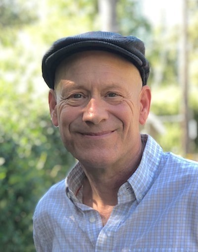

---
#
# By default, content added below the "---" mark will appear in the home page
# between the top bar and the list of recent posts.
# To change the home page layout, edit the _layouts/home.html file.
# See: https://jekyllrb.com/docs/themes/#overriding-theme-defaults
#
layout: home
---

<table style="width:100%; border:none;">
<tr style="border:none">
<td style="border:none; width:70%">
E. Wes Bethel is a Professor in the 
<a href="https://cs.sfs.edu/">Computer Science Department at San Francisco State University</a>,
a Research Affiliate at 
<a href="https://www.lbl.gov">Lawrence Berkeley National Laboratory</a>,
and an
<a href="https://awards.acm.org/award-recipients/bethel_3127172">ACM Distinguished Member</a>.
His research interests include high performance computing, advanced computational architectures and technologies, quantum computing, data science, machine learning and its applications, scientific visualization, and computer graphics.
</td>
<td style="border:none; width:30%">

</td>
</tr>
</table>

